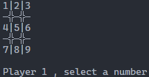
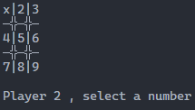

# Download

If you want the source code you can download it from [Releases](https://github.com/SkillSageDev/TicTacToe/releases/tag/Latest) or use  `git` :

```bash
git clone https://github.com/SkillSageDev/TicTacToe.git
```

- then run TicTacTio.exe to start playing

If you only want the game, (the .exe file), you can download it from [here]().

# Explaining The Code

## main idea

1. ask player if they wanna play or no.
2. if he choosed to play, the game asks him to choose a symbol, **he can only choose 'x' or 'o'**.
3. print the board and asks player to choose a number.

   

   **for examble**: if player choosed 1, the board will change number 1 in the board to the player's symbol, then it will ask player 2 to pick a number
   
   

4. the game loops until win or draw happen, then asks player if they wanna restart the game, or quit the game.

## code diagram 👇


> you can check it out from [here](https://viewer.diagrams.net/?tags=%7B%7D&highlight=0000ff&edit=_blank&layers=1&nav=1&title=TicTacTio.drawio#R7V3bcts2EP0azTgP6oikRNuPlpy4ae2OEzVN25cOREIiEopgQMiS%2FPUFKFIXC%2BDFvDuIM2NzCUIg9nB3cXZB9YzJcnNHgO88YBu6PX1gb3rGbU%2FXtaExZL%2B4ZLuTXJqDnWBBkL0THQmm6BlGV8bSFbJhEMl2IoqxS5F%2FKrSw50GLnsgAIXgdnHzIHLv2SRsfLOCZYGoB91z6FdnU2UmvRoOD%2FFeIFk78ydogOrMEceNIEDjAxusjkfG%2BZ0wIxnT313IzgS6fvNN5%2BSA5ux8YgR7NcsF0%2BPQFTFdfvN8%2BPY3Q5j%2Fn%2Bf26r0djo9v4hqHN7j86xIQ6eIE94L4%2FSMcErzwb8l4H7OjQ5h5jnwk1JvwGKd1GygQripnIoUs3OssGTLZ%2F8%2Bt%2FGcWH%2F0TdhQe3m5OjbXR0fsfRJAR4Raxo%2FE9fL7e3z2Dz%2Bfvo073%2B%2B79rbXjTj5EDyAJGlzp09sEkg9mXb5v%2FwHR8h5%2FN6752uWvIJ%2BHoE6IJvYN4CdmAWAMCXUDR0ylIQIS1xb7dQR3sj0gjYu0kDfsJuKvok3q66bIbGM8xmwKOeheT8Iz5Y8WBxObIuL4eWhyFB9GRfmMh76AfhBq6YQ20ob8Jmx4uMhf89x1YwvhD2T3sPnd36gw6wRotXeDBqPsYRVzlwEULj%2F1tMdVBNuLxEyQUscfsJjpBOXbGloNc%2Bx5s8YprKaDA%2Bh4fjR1M0DPrFsQwYqcJjUCmmyctpvzKCDUE8tt8jFGjvRA9gM1Jw3sQ0EjAZtcFfoBm%2B9tYMgAhb4wpxcuo0dpBFE59EOJvzYzgKdbnyHUney0Z8xH%2FiSboSL77F94Uwd%2Fh0Rkz%2FJeEfj6VcJMI1%2BiscamzJy68KDLHWmzI1gfjphtRG%2BfIsBlxw9JBrqeB%2FPXgjTuaCXsRtR9necDm81AlgssHviZ7WPhIi3RtgiWHljcL%2FKM7O3sk9%2BJZtkmYYWJD0o8GcxMqglz0%2B8fyd4mTK9XSa7qWz8p8fj4ED64rm5jUGxaO1GDWVzTSRxdsmd1LHlwaMEQdX7xL6XRGSkS3LvuwEN0yRSgoKigKoDgogkY%2FvIugKms7KDA%2F5%2FFXxRPfG7H%2FtzVO%2FgwDYitT0HlTME7SY1cswRJ6K4XFzmPxIUGNXYGitSJ8dZZs6Jt0TbJZQmE3WaepzidoLINvTQ%2BVSAfI81fS%2BZKbHGVeJKip4QZkVmdqAc%2FLGpQ1McMXzQ9NFs9OtwGFS8n4fmnFc9r85Mn0muaWynDD2Wx2GqtL4YbLT4lJD%2B9o3lN288OA%2FXzoHeheF875tWKyN%2FCBhbzFfdjmdniQfI5oRy7C7Nq5G%2BZNHGTbkF0%2BJpgCCnasLKdgfcz8V0hL8oXQmEF1wjMLfEk0Ycfa4Zj9580JnWCP3RBAIZUKQUDXkNO%2BaWzuOQebyNunE7MRDaub2VhYLU6nlc7CGgIW9gUQXBTqfAeEOBn2kuOOgJECgCVTZZhLijT%2BZ5g56mtnqDDOUWEIEOCCGXQfcYAowrx%2Fsmv7Ahlpyj%2BFOPIcSBCtUOuamZF8v6pI6cOmqPeuRoSyMCJMRSWmyhp3OPKFkDxibXC4TxilMRMSF6nWLTKUcs5UgVSBtNUgJVAZU4XT9uN0jbyJA63vCqQlDXeGsQtB2pJd4TQnTm0C1gqoCqitB2oA6cp%2FTE7rN6%2F8jmH1DXj%2BTBm5pCXPnyvSYiJYAUpZvjWilpOnPEgBVQG1kbU5s6cWnG6XM%2BwqpCqkthapP1ZIUUjdBanKSTefk9bMq4xJ6Su9eH5SuDvRbGJ3YoFdhoJthklbntqyy7AF2wyTK5HVPsNu7TPUz%2BsajOFAYDnMqjYVavXsKsxLU5RcUaqK2IuEIq%2Fhk3LVi%2BaLBwv0WUqFZk7AVjAFdZbqp25hyty76E4sB5BMu7JU8NurJfgtoyJT6MKGVRVkaqois3hFZm61X2aMXKqqyNTqKcksK71iEQho%2FbsIC9vnDGwGdzZtS2YR9oC83dkua5pWvg0orGyekvbKFds96GBkyRnLSRkxSeHdg6KBBznyAeUEhIUhma2Go4U2AAV%2FMU9uP7Aw7C2Bu7sYURF8r50R%2FOU5fS0O5apir0cdY69H3WSvR82z1ymlG4q%2B7hZ9bQr4a90Q8ddaZetAs5Z14BuqBFAva6iHRm%2BwqEO9rCF9aOplDRXo9ZUva6gue5G84i4nfaGWPW1Y9owyBy9Jr5KoNXFxWVLiIgcM3mb2IrfuBdkLoe4ri1qvpFFr0XhqkD26bTIKlSZKHIyDjhdO1%2BtSlO%2Bo33cIKDOx7yihbEtImWlneu%2F611EIv2YiK9OmNcW0JY26XEoi3yom8SWhimbrFs1mXI4y0mwDsyJIy1m2nyReUayZYs2anmHFminWTMX7ueL9xPisdKpIL4EqEo64LKbo5yhxLUfpwi%2F8qoYjEg5YUUQSP70EbTbmHduufFTHdr7juDDQjtqQxexisCvOjH%2B1MTsuAx30bIW58jGXJ094Bk8VLrUzXBplZUercp3CzFrNpW43vi%2FFqSLgukXADeMv2Y4BPjyPDfdbtI8RPiqhZFaMcHl0WNP2p%2FI4bNmSfZHwWprCabb8bNVrNiFkf7NOSf5eFZ3U6Rn3fqYIkyA0HHpVRL5%2B3XxyauKCIPDU96W%2FHQd5feofDVF9jSaA%2BXUJ%2BXEhzONws2Xbg2Wujq2wUGjoqnJ3dOunOSLlM2rxGXsDXIh9Fj1MlfkMQ%2FTeK0U%2F56Kf86s9Xjukqb2qRbSht9KESllhSB0s4%2BguitvOKvaDp5j9d8ru%2F8x2X%2FSldyIDYJQQRG3t5cftAP7x8dMfj1%2F7f2n39ONzNXVsEgNA4ByyGTzZ%2BZ4bluyekB%2BErsMBPhdaLl7ZHQumtfjdobH%2FF0TTmi7yBFUBob2vF03C7XHVaOIjWXnZKDskmON%2Ff%2B6OQdB5wDbkLf4H) also.

# classes

1. [Board](#board)
2. [Player](#player)
3. [Menu](#menu)
4. [Game](#game)

## Board

> main task: creat, print, and update the board.

### Variables:

#### 1. input

- get the player input using `Scanner` class.

#### 2. board

- one dimensional array that stores numbers from (1-9) as a char.

### Methods:

#### 1. creatBoard()

- creat a new board.

#### 2. printBoard()

- print the board using for loop.


#### 4. isValidMove(int choice)

- make sure that there is no symbol in the given index.

#### 3. updateBoard(int choice, char symbol)

- the player picks a number to place his symbol, that number will be stored in `choice` variable.
- `symbol` stores player's symbol.

- update the board according to `choice` & `symbol` if `isValidMove(choice) == true`.

## Player

> main task: creat players with different symbols.

### class variables:

#### 1. input

- get the player input using `Scanner` class.

#### 2. symbol

- a char variable that stores the player's symbol (x or o).

### class methods:

#### 1. chooseSymbol()

- asks the player to choose a symbol, player can only choose (x or o).

- return `symbol`.

## Menu

> main task: asks player to start, restart, quit the game.

### class variables:

#### 1. input

- get the player input using `Scanner` class.

### class methods:

#### 1. main()

- print **main menu** that asks player to start or quit game.

    

- return `input.nextInt()`.

#### 2. end()

- print **end menu** that asks player to restart or quit game.

    

- return `input.nextInt()`


## Game

> main task: loop the game until win or draw.


### class variables:

#### 1. input

- get the player input using `Scanner` class.

#### 2. p1 & p2

- objects from class `Player`.

#### 3. players

- list that stores `p1` & `p2`.

#### 4. menu

- an object from class `Menu`.

#### 5. board

- an object from class `Board`.

#### 6. currentPlayer

- int variable that stores 0 or 1 to indicate player's turn.

### class methods:

#### 1. restartGame()

- runs `board.creatBoard()` to print the board.

- runs [`playGame()`](#2-playgame) method.

#### 2. switchPlayer()

- it change currentPlayer to 1 or 0 by this equation `currentPlayer = 1 - currentPlayer`

- so if `currentPlayer = 0` when you invoke `switchPlayer()` it will be `currentPlayer = 1 - 0` which is 1.

- if you invoked `switchPlayer()` again `currentPlayer = 1 - 1` which is 0.

#### 3. replaceSymbol()

- asks player to pick a number must be from (1-9), then **start an infinit loop**.

  - **start a try**

    - runs `input.nextInt()` and stores it in an `int` variable called `choice`
    - checks if `board.updateBoard(choice, players[currentPlayer].symbol) == true`,
    - if it is `true` it will break.
    - if it is `false` it will print **invalid move** and run `board.updateBoard(choice, players[currentPlayer].symbol)` again.
  
  - **start a catch**
    
    - prints **invalid choice** because the player didn't enter a number between (1-9).
#### 4. winCheck()

- it got `int` **two diminsial array** called `winConditions`, from the name it stores every possible win condition.
  
- then runs **for each loop** `for( : )` to store every condition from `winConditions` to an `int` **array** called `condition`.

  - checks if `board.board[condition[0]] == board.board[condition[1]]
                    && board.board[condition[1]] == board.board[condition[2]]`.

    - lets say in the first for loop `int[] condition = {3,4,5}` which means that if `board.board[3] == board.board[4] == board.board[5] ` someone won!

    - and you know that `condition[0] = 3` & `condition[1] = 4` & `condition[2] = 4`.
    
    - so we do  `board.board[condition[0]] == board.board[condition[1]]
                    && board.board[condition[1]] == board.board[condition[2]]` to achieve the same result as `board.board[3] == board.board[4] == board.board[5] `.
                
  - return `true` if they are equal.
  - return `false` if they are not equal.

#### 5. drawCheck()

- runs for each loop `for( : )` in `board.board` and store every char in the board to `c` variable.
- return `true` if `winCheck() = false` & `c` is a symbol.
- return `false` if `winCheck() = false` & `c` is a digit.
  
#### 6. playTurn()

- runs `board.printBoard()` to print the board.

- **start an infinit loop**
  
  - if [`winCheck()`](#4-wincheck) or [`drawCheck()`](#5-drawcheck) methods equals to `false`, it will run [`replaceSymbol()`](#9-replacesymbol) & [`switchPlayer()`](#8-switchplayer) methods, then break.

#### 7. playGame()

- **start an infinit loop** then runs [`PlayTurn()`](#7-playturn) method.

  - check if [`winCheck()`](#4-wincheck) or [`drawCheck()`](#5-drawcheck) methods equals to `true`.

  - runs `board.printBoard()` to print the board.

  - runs `menu.end()` to print end menu and store the return value in `choice` variable.

  - then runs another loop to check if `choice == 1` or `choice == 2` only.

    - if `choice == 1` it will run [`restartGame()`](#3-restartgame) method and set choice to 2, `choice = 2`.

    - if `choice == 2` it will break twice to get out from first loop and the second loop.

    - else runs `menu.end()` to print the end menu and store the input in `choice` variable.

          


#### 8. setupPlayers()

- runs `players[0].chooseSymbol()`
- if `player[0]` choosed 'x' it will set `player[1]`  symbol to 'o'
- else it will set `player[1]`  symbol to 'x'.

#### 9. startGame()

- runs `menu.main()` that asks player to start or quit game.

    


- get his input and store it in `choice` variable, then **start an infinit loop**.

  - if `choice == 1`, it runs `board.creatBoard()` to creat a new board, and runs `setupPlayers()` & [`playGame()`](#2-playgame) methods.

  - then set `choice` to 0.

  - if `choice == 2` it runs [`quitGame()`](#10-quitgame) method then break from loop.

  - else run `menu.main()` again, then store the input in `choice`.

#### 10. quitGame()

- prints `Thanks for playing!`.